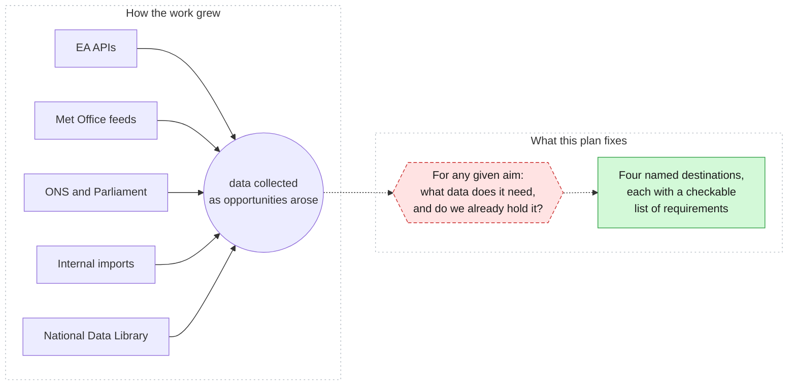
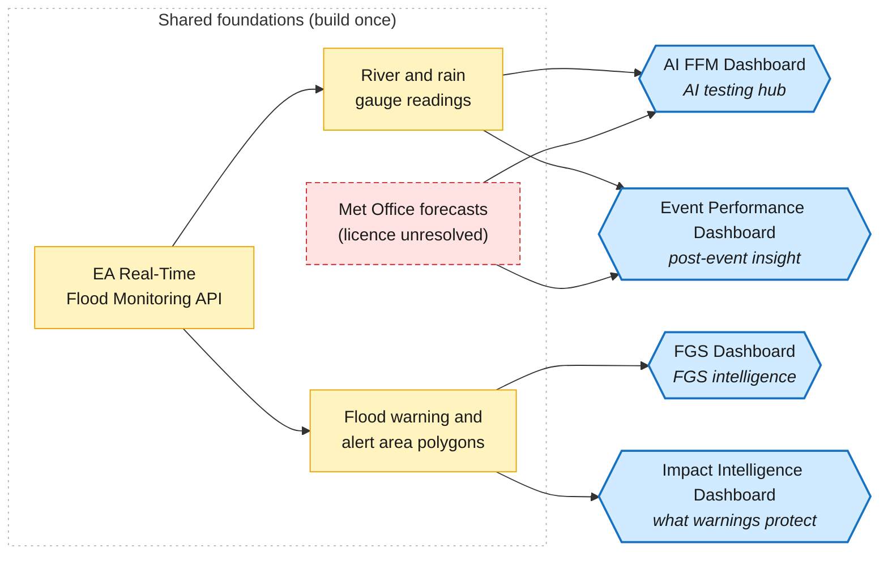
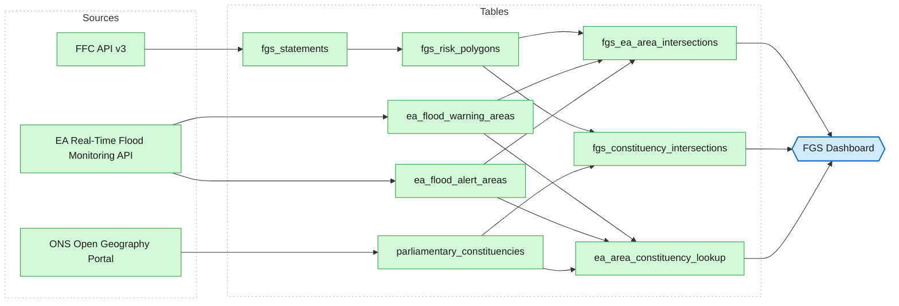
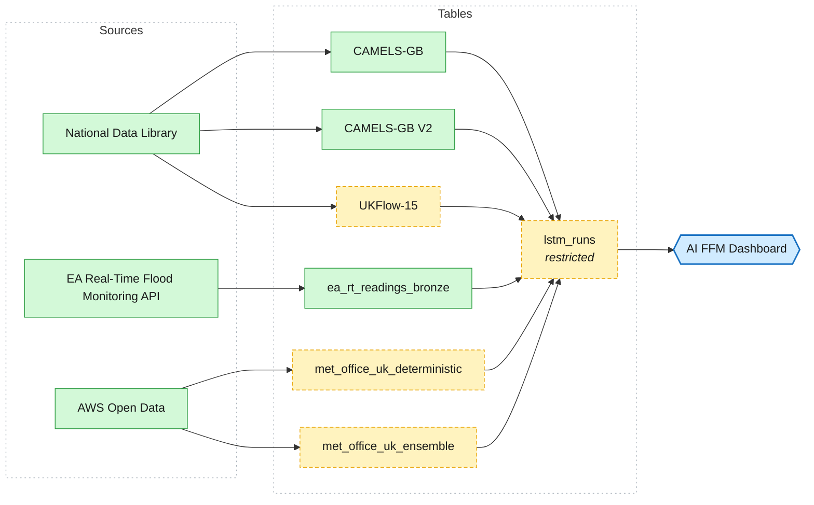
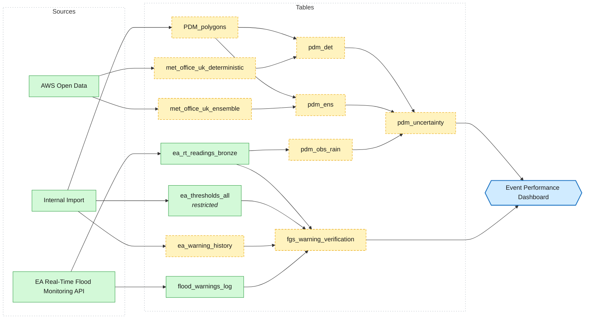
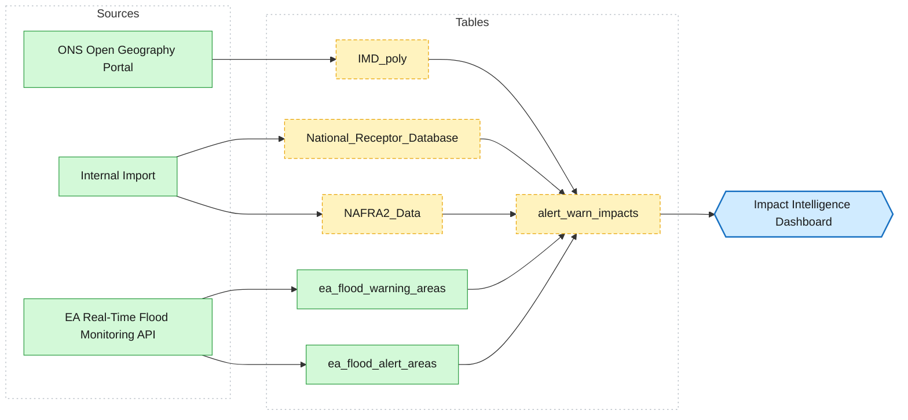

# DASH work plan

## Summary

Four dashboards organise everything this plan covers: an FGS intelligence tool (built), an AI testing hub, a post-event performance view, and an impact intelligence view. Each has a fixed list of required data, checked against what already exists. Fifteen items remain to build across the three unfinished dashboards, sequenced in one order at the end of this document. Two need decisions before build work can proceed: the Met Office forecast licence, and the scope of NAFRA2.

## Why this plan exists

The FGS pipeline and the work that followed it grew inside DASH the way projects do when the destination isn't fixed at the start. A source became useful, it was pulled in, and its purpose settled later. That built capability quickly. It also made a simple question hard to answer: for any given aim, what data does it need, and do we already hold it?

An unanswerable requirements question has a cost. Ingest work gets duplicated because nobody knew the data was already in Bronze. Gaps surface during build, when they're expensive, rather than during planning, when they're cheap. This plan closes the question by naming four destinations and tracing exactly what each one needs.

## How the four fit together

The four dashboards share foundations. Gauge readings feed both the AI hub and the post-event view. The flood warning and alert area polygons feed both the FGS tool and the impact view. The EA Real-Time Flood Monitoring API sits behind all four. Building each dashboard as a separate project would mean building some of this twice.

One shared foundation carries a risk worth owning now rather than discovering later. The Met Office forecast feeds (MOGREPS-UK and UKV, drawn from AWS Open Data) sit under a non-commercial licence the Met Office does not support for operational use. Two of the four dashboards depend on them. Until the licence position is resolved, neither can be called deliverable, whatever else gets built.

## FGS Dashboard: FGS intelligence tool

Built. Every table in its chain is live: the FGS risk polygons, their intersections against EA flood warning and alert areas, and their intersections against parliamentary constituencies. The constituency work exists because of the Director-level requirement to notify MPs when a Flood Warning is issued in their constituency. The remaining work is operational: keeping the pipeline running.

**Built**
`EA Real-Time Flood Monitoring API`, `FFC API v3`, `ONS Open Geography Portal`, `ea_flood_warning_areas`, `ea_flood_alert_areas`, `parliamentary_constituencies`, `ea_area_constituency_lookup`, `fgs_statements`, `fgs_risk_polygons`, `fgs_constituency_intersections`, `fgs_ea_area_intersections`.

**Still to build, in dependency order**
Nothing. This chain is complete.

## AI FFM Dashboard: AI testing hub

A review surface for one question: are the LSTM model runs any good, and what were they trained on. Three training sets and three rainfall inputs feed a single model-output table, `lstm_runs`, which the dashboard reads.

`lstm_runs` sits in the restricted schema. Model outputs of this kind carry access implications that a permissive default would understate, and the source records currently disagree with themselves on this point. The source needs correcting to match.

**Built**
`AWS Open Data`, `National Data Library`, `CAMELS-GB`, `CAMELS-GB V2`, `EA Real-Time Flood Monitoring API`, `ea_rt_readings_bronze`.

**Still to build, in dependency order**
- `UKFlow-15`
- `met_office_uk_deterministic`
- `met_office_uk_ensemble`
- `lstm_runs` (restricted)

## Event Performance Dashboard: post-event insight

The deepest chain of the four, and the only one owned jointly by two workstreams: Warning verification and Post-Event. It answers two questions after an event. How good were the warnings we issued, measured as lead time against false alarms? And how much uncertainty sat in the rainfall forecast at the catchment scale where operational decisions are actually made?

Nine items remain here, more than the other three dashboards combined. Most belong to the PDM rainfall chain, three tables deep before it produces anything usable. Two of its three uncertainty inputs trace back to the Met Office feeds, so the licence question above gates this dashboard as well as the AI hub.

**Built**
`AWS Open Data`, `EA Real-Time Flood Monitoring API`, `Internal Import`, `ea_rt_readings_bronze`, `ea_thresholds_all` (restricted), `flood_warnings_log`.

**Still to build, in dependency order**
- `PDM_polygons`
- `ea_warning_history`
- `fgs_warning_verification`
- `met_office_uk_deterministic`
- `met_office_uk_ensemble`
- `pdm_det`
- `pdm_ens`
- `pdm_obs_rain`
- `pdm_uncertainty`

## Impact Intelligence Dashboard: what warnings protect

The other three dashboards cover where the water goes and how well we predicted it. This one covers what's in its path: deprivation data, the national receptor database, and NAFRA2, intersected against the same warning and alert areas already live for the FGS tool. It turns a warning area from a polygon into a picture of who and what sits inside it.

One decision gates the build. NAFRA2 is broad, and its useful subset for this purpose is undecided. That decision comes first. Ingesting it whole would repeat, inside a single table, the exact collect-first-decide-later pattern this plan exists to end.

**Built**
`EA Real-Time Flood Monitoring API`, `ONS Open Geography Portal`, `Internal Import`, `ea_flood_warning_areas`, `ea_flood_alert_areas`.

**Still to build, in dependency order**
- `IMD_poly`
- `NAFRA2_Data`
- `National_Receptor_Database`
- `alert_warn_impacts`

## Build sequence

All fifteen remaining items in one order. Shared dependencies appear once. Nothing is scheduled before its own inputs. The two decision gates (Met Office licence, NAFRA2 scope) sit outside this sequence and can be progressed in parallel with the early items, neither of which depends on them.

1. `IMD_poly`: Warning Reference, feeds Impact Intelligence Dashboard
2. `NAFRA2_Data`: Warning Reference, feeds Impact Intelligence Dashboard
3. `National_Receptor_Database`: Warning Reference, feeds Impact Intelligence Dashboard
4. `PDM_polygons`: Post-Event, feeds Event Performance Dashboard
5. `UKFlow-15`: AI Flood Forecasting, feeds AI FFM Dashboard
6. `alert_warn_impacts`: Warning Reference, feeds Impact Intelligence Dashboard
7. `ea_warning_history`: Warning verification, feeds Event Performance Dashboard
8. `fgs_warning_verification`: Warning verification, feeds Event Performance Dashboard
9. `met_office_uk_deterministic`: AI Flood Forecasting, feeds AI FFM Dashboard, Event Performance Dashboard
10. `met_office_uk_ensemble`: AI Flood Forecasting, feeds AI FFM Dashboard, Event Performance Dashboard
11. `lstm_runs` (restricted): AI Flood Forecasting, feeds AI FFM Dashboard
12. `pdm_det`: Post-Event, feeds Event Performance Dashboard
13. `pdm_ens`: Post-Event, feeds Event Performance Dashboard
14. `pdm_obs_rain`: Post-Event, feeds Event Performance Dashboard
15. `pdm_uncertainty`: Post-Event, feeds Event Performance Dashboard
